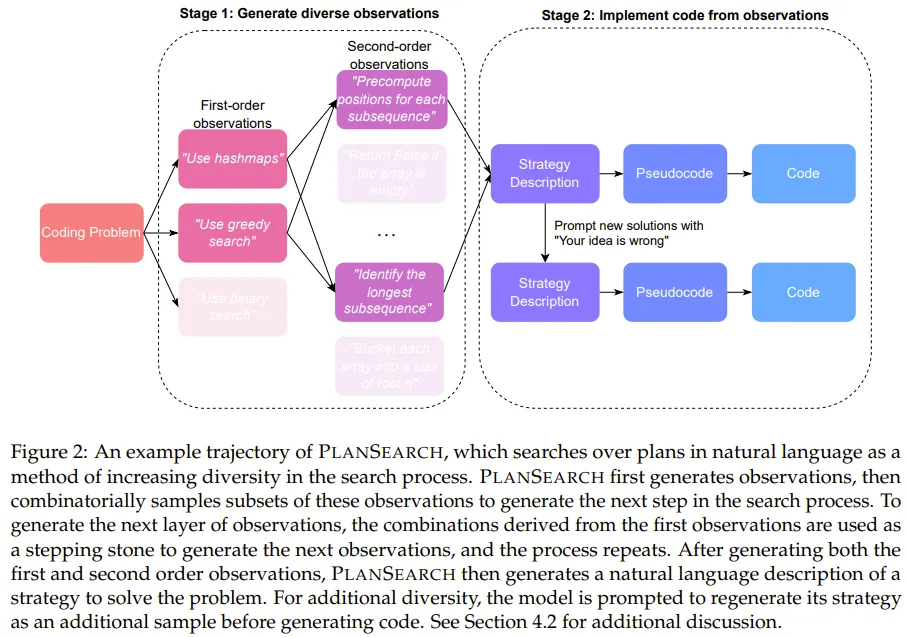

+++
title = 'Plan Search'
date = 2024-09-11T20:02:20+08:00
draft = false
+++

- 目前阻碍模型应用「搜索」的主要难题是模型给出的答案过于雷同，缺乏多样性。
- > 经过特别指令调整的模型在只生成一个答案的情况下（pass@1）通常比基础模型表现得好很多，但当需要生成多个答案时，这种优势就不明显了.

- > 模型在生成答案时缺乏多样性，这对于搜索的效果非常不利。特别是在极端情况，比如采用「贪心解码」，模型给出的答案会非常相似，因为它们是从模型中重复抽取的。这种情况下，即使模型花费更多推理时间，也难以获得更好的搜索结果。

为什么多样性很重要？因为搜索的目的是找到最佳答案，而不是找到一个答案。如果模型给出的答案都是雷同的，那么搜索的结果就会受到很大的影响。
多样性和搜索结果的关系：多样性可以补充更多角度，而这些更多角度可以更全面的了解问题，从广度上来说，多样性可以提供更多的选择，从深度上来说，多样性可以提供更多的细节。但是通常广度与深度是相互矛盾的，所以多样性的提升需要在广度与深度之间取得平衡。
- > 通行的大模型排行榜，例如例如 LMSYS Chatbot Arena、LiveCodeBench、OpenLLMLeaderboard
- > 首先，研究人员发现，如果给模型一些简单的草图（这些草图是从已经能解决问题的代码中「回译」而来），模型就能根据这些草图写出正确的最终程序。其次，研究人员还发现，如果让模型在尝试解决问题之前，先在 LiveCodeBench 上想出一些点子（这个过程叫做 IdeaSearch / 思路搜索），然后看看模型能不能用这些点子解决问题。

先做路径规划，和蒙特卡洛树搜索的思路有点像，但是这个思路是在生成答案之前，而不是在生成答案的过程中。
这和我的想法类似, cot-and-prompt, 正确的COT可以引导模型生成正确的答案。那从泛化的角度来说即是如何对于不同问题，找到合适的COT。
有点回归到了auto-learning的问题上。
- > 结果发现，模型要么完全解决不了问题（准确度为 0%），要么就能完美解决问题（准确度为 100%）。

路径依赖,有点反直觉。因为0%和100%作为两个极端，往往路径中的偏差应该是个别节点的误差不足以导致整体差距这么极端。
- > 不同于之前的搜索方法（通常是搜索单个 token、代码行甚至整个程序）不一样，规划搜索是搜索解决当前问题的可能规划。这里，规划（plan）的定义是：有助于解决某个特定问题的高层级观察和草案的集合。

强化学习的做法, 能应用在泛化的场景下吗。比如在特定范围内，AlphaGo之于围棋，个别程序语言的CodeGen的路径可能是相似的。
Assumption: 泛化也许可以用LLM本身的能力来做路径，类似于Anthropic的metaprompt，用来针对于不同的应用场景生成对应的COT。当然这里的前置条件是LLM本身的知识体系中有，且足够精准。也许某种finetuned Plan LLM?

- > 在这项研究中，该团队探索了多种不同方法，包括重复采样（Repeated Sampling）、思路搜索（IdeaSearch）以及新提出的规划搜索（PlanSearch）。其中前两种方法顾名思义，比较直观，这里我们重点关注新提出的规划搜索。

做法还是类似于(Code)Agent的方法论, Use hashmap≈Use Memory. Greedy Search≈Tool.

- > 1. 通过提示来获取观察
- > 2. 推导新的观察
- > 3. 将观察变成代码
- > 具体来说，对于每个叶节点，将所有观察以及原始问题 P 放入提示词来调用 LLM，以便生成问题 P 的自然语言解决方案。为了提升多样性，对于每个生成的思路，该团队通过假设该思路是错误的来生成一个额外的思路，并要求 LLM 给出批评 / 反馈，从而将提议的思路翻倍了。
然后，再将这些自然语言解决方案转译成伪代码；再把这些伪代码转译成真正的 Python 代码。

通过反复的rewrite来保证多样性吗。
也许本身在即使没有使用路径规划（规划和思路搜索）的情况下，也可以通过rewrite来提高回答质量。
- > 在 Claude 3.5 Sonnet 上使用规划搜索方法时，在 LiveCodeBench 基准上得到了当前最佳的 pass@200 性能：77.0%。该表现优于不使用搜索时获得的最佳分数（pass@1 = 41.4%）以及标准的 best-of-n 采样方法的分数（pass@200 = 60.6%）。

pass@200是基于之前的重写吗，如果是那路径规划确实是有效的。
- > 规划搜索并不利于某些模型的 pass@1 指标，其中最明显的是 Sonnet 3.5 在 LiveCodeBench 上的表现 —— 这是实验中表现最好的组合。
该团队基于直觉给出了解释：提升思路多样性可能会降低生成任何特定思路的概率，同时增加在给定池中至少有一个正确思路的几率。因此，pass@1 可能会略低于平常，但也正是由于这个原因，pass@k 指标可能会优于缺乏多样性的思路池。
  
这点很有趣，实际上的F(ideas≈COT)≈answers@k.这里同一个思路可以生成的方案集合中是k个。而思路可能是N次重写的尝试。也就是实际上需要尝试的次数会是之前的N倍。 
